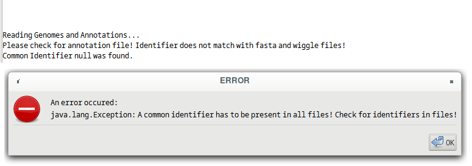

Getting started
================

.. _installation:

Preparing the input files
------------

TSSpredator can be run either analyse TSS data derived from one bacterial organism
to compare different conditions or from several different bacterial organisms to compare
different strains/species.
Comparison of different strains/species For this case, a multiple genome alignment
of the genomes studied needs to be precomputed. We recommend to compute this
using progressive Mauve (available from <http://darlinglab.org/mauve/user-guide/progressivemauve.html>). It saves the alignment in an xmfa file format, which is then
loaded into TSSpredator.
For each analysed organism, TSSpredator needs the genome file in fastA format.
These need to be the identical fastA files that were used for the multiple genome
alignment. In addition TSSpredator is able to use an annotation file in gff or gtf
format for each genome in order to classify found TSS. Please make sure that the
identifier of the header in the annotation file is written after ##Type DNA identifier or
##sequence-region identifier, as you can see in the following example:

.. code-block:: console

	##gff-version 3
	#!gff-spec-version 1.14
	#!source-version NCBI C++ formatter 0.2
	##Type DNA AJSZ01000001.1
	AJSZ01000001.1 RefSeq gene 217 633 . - . ID=STSU 00005;
	
or

.. code-block:: console

	##gff-version 3
	#!gff-spec-version 1.14
	#!source-version NCBI C++ formatter 0.2
	##sequence-region AJSZ01000001.1
	AJSZ01000001.1 RefSeq gene 217 633 . - . ID=STSU 00005;

Identifier coherence
----------------

One important issue before starting TSSpredator is to check the input data for the
used identifier. The genome fastA file(s), the respective annotation file(s) and all
wiggle files should have the same identifier in the header. The following example shows,
how it can look like:

.. code-block:: console

	Genome fasta header:
	>NC 000915.1 Helicobacter pylori
	Wiggle file:
	chrom=NC 000915.1
	Annotation file:
	##gff-version 3
	#!gff-spec-version 1.14
	#!source-version NCBI C++ formatter 0.2
	##Type DNA NC 000915.1
	NC 000915.1 RefSeq gene 217 633 . - . ID=NC 000915.1:nusB;

The first column of the annotation file must be the same identifier as the header
or a part of it, i.e. it should be contained. But it should be noted that for further
analyses, for example when using the Integrative Genome Browser, the fastA IDs have
to be the same as the ones in the first column of the annotation file. If the first column

.. _figGUI:

	
    Figure 4
	
is only a part of the header ID, TSSpredator will run without problems but in further
analyses problems can occur. The user has the option to address this problem after TSS
prediction, depending on what post-TSS prediction work will be done.
In the following typical error messages and warnings are shown. If there is no match of
the identifiers between all three files, TSSpredator will stop and print the following
exception, see :ref:`fig-wrongID`. This could be the case if an annotation file or another species is used
or the header IDs are not identical.

.. _fig-wrongID:

	
	Figure 1

If an annotation file is missing, prediction of TSS is still done without classification and
all TSS will be classified as orphan. 
See :ref:`fig-noGFF`.

.. _fig-noGFF:

	
	Figure 2

In the case of a multi-contig genome of a genome containing a plasmid together with
a chromosome, TSSpredator first checks all headers and in the case of mismatched
headers, warnings are printed in the message area about the failed header evaluation, see figure :ref:`fig-contigs`.
TSSpredator will not stop TSS prediction.

.. _fig-contigs:

	Figure 3

Overview
----------------

There are two ways to use TSSpredator. The most convenient way is to use its graphical user interface (GUI), which is described in section 5. Here, all settings and parameters
can be specified that are needed for the prediction. For a detailed description of the parameters see section 6. After setting up the study the configuration can be saved. Pressing
the RUN button starts the prediction procedure. All results are saved in the specified
output folder. The most important result file is the Master Table (MasterTable.tsv ). For
a detailed description of all result files see section 7.
Another way to utilize TSSpredator is via its command line interface. This
is especially useful for automatization or integration in an analysis pipeline. For this,
TSSpredator has to be started with a single argument, which is the path of a configuration
file (e.g. called 'config.conf'), as it is saved by TSSpredator's GUI. For example:

.. code-block:: console

	java -Xmx1G -jar TSSpredator.jar config.conf

